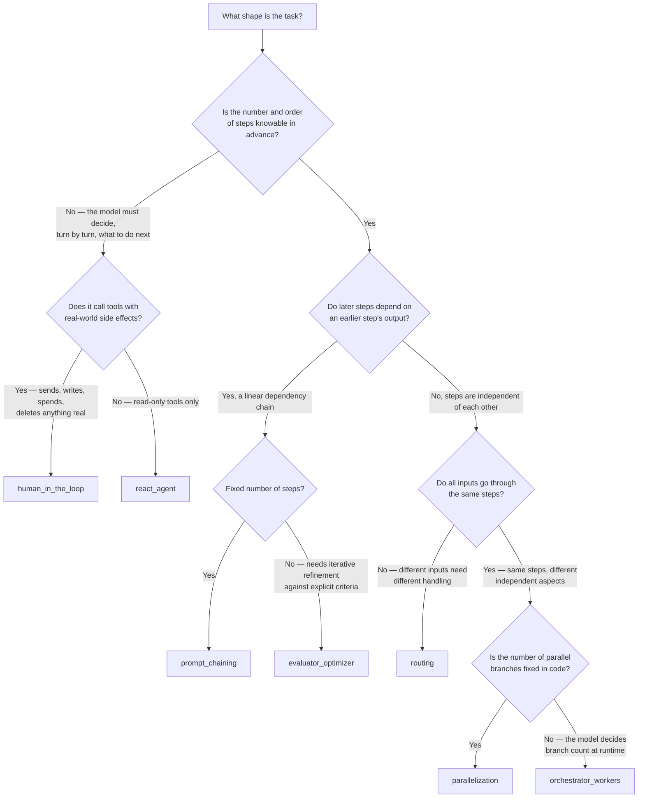

# Architecture Overview

This page is the cross-pattern view: how to pick between the seven
patterns, how their cost/latency/risk profiles compare, and how they
relate to each other structurally. Each pattern's own README (linked
below) goes deep on that pattern specifically — where it fits, where it
doesn't, architectural tradeoffs, production infra, and relevant
open-source components. For how these patterns map onto real agent
harnesses rather than this repo's demo graphs — the different shapes a
harness itself can take and what should guide picking one, plus memory,
guardrails, MCP tool integration, and evals, the four things production
adds beyond the graphs themselves — see
[`docs/harnesses-and-loops.md`](harnesses-and-loops.md).

- [`prompt_chaining`](https://github.com/jithinkk/agentic-design-patterns/tree/main/patterns/prompt_chaining)
- [`routing`](https://github.com/jithinkk/agentic-design-patterns/tree/main/patterns/routing)
- [`parallelization`](https://github.com/jithinkk/agentic-design-patterns/tree/main/patterns/parallelization)
- [`orchestrator_workers`](https://github.com/jithinkk/agentic-design-patterns/tree/main/patterns/orchestrator_workers)
- [`evaluator_optimizer`](https://github.com/jithinkk/agentic-design-patterns/tree/main/patterns/evaluator_optimizer)
- [`react_agent`](https://github.com/jithinkk/agentic-design-patterns/tree/main/patterns/react_agent)
- [`human_in_the_loop`](https://github.com/jithinkk/agentic-design-patterns/tree/main/patterns/human_in_the_loop)

## How to choose a pattern

The decision that matters most is **how much of the control flow can you
write in code versus how much has to be decided by the model at runtime**.
Everything else follows from that:

A rule of thumb that follows from this tree: **prefer the most constrained
pattern that still solves the problem.** Every step down toward
`react_agent` trades away a compile-time guarantee (bounded latency,
bounded cost, a fixed set of code paths to test) for more flexibility. Only
pay for that flexibility where the task genuinely needs it — most
"we need an agent" requests turn out to be routing or orchestrator-workers
in disguise, and both are cheaper to run and easier to keep correct.

See [`docs/real-world-examples.md`](real-world-examples.md) for this tree
applied to concrete scenarios, including a couple of cases where the
tempting first choice is wrong.

## Comparison

| Pattern | Latency profile | Cost profile | Predictability | Primary production risk |
|---|---|---|---|---|
| `prompt_chaining` | sum of step latencies | linear in step count | high — one fixed path | an early bad step cascades downstream (mitigated by the gate) |
| `routing` | +1 classification call, then one handler | low–medium | high per branch | misclassification is a silent failure — no automatic detection |
| `parallelization` | max(branch latencies) | sum of branch costs | high | partial branch failure, shared rate limits under concurrent fan-out |
| `orchestrator_workers` | orchestrator + max(worker latencies) | sum over N workers, N is runtime-decided | low — N is dynamic | unbounded fan-out cost/latency if subtask count isn't capped |
| `evaluator_optimizer` | up to `2 × max_iterations` calls | up to `2 × max_iterations` calls | medium — bounded by the cap | non-convergence; a correlated blind spot between generator and evaluator |
| `react_agent` | unbounded turns | unbounded | low — no compile-time bound | unbounded loops, tool misuse, side effects with no built-in approval gate |
| `human_in_the_loop` | unbounded turns + human response time | unbounded + a human's time | low, plus human-paced for gated calls | a stuck/abandoned approval blocks the run forever with no timeout by default |

The first five rows are what Anthropic's post calls **workflows** —
graphs whose shape is fixed in code even though individual node outputs
are model-generated. `react_agent` is the one **agent** in this repo: the
model itself chooses the graph's path through tool calls, not just the
content of each step. `human_in_the_loop` is `react_agent` plus one more
layer: the model still chooses the path, but a side-effecting choice
doesn't execute until a human signs off. That distinction — fixed control
flow vs. model-chosen control flow vs. model-chosen-but-human-gated — is
the single biggest predictor of how hard a pattern is to test, cap the
cost of, and run safely unattended.

## Structural relationships between the patterns

A few of these patterns are more closely related than the flat list
suggests:

- **`parallelization` vs. `orchestrator_workers`** — structurally almost
  identical (fan-out, then fan-in through a reducer). The only difference
  is *when* the branch list is known: at graph-build time
  (`parallelization`, plain edges) vs. at run time
  (`orchestrator_workers`, `Send`). If you start with `parallelization`
  and find yourself wanting a variable number of branches, that's the
  upgrade path — not a rewrite.
- **`evaluator_optimizer` vs. `prompt_chaining`** — both are linear, but
  `evaluator_optimizer` adds a cycle (revise-until-pass) where
  `prompt_chaining` only ever moves forward. `prompt_chaining`'s gate is a
  one-shot version of the same idea: a checkpoint that can stop the chain,
  just without looping back to fix the problem.
- **`routing` vs. `react_agent`** — routing is a single, one-shot decision
  among a fixed set of branches; `react_agent` is the same kind of
  decision (what should happen next?) made repeatedly, informed by
  intermediate results, with no fixed branch set. A `react_agent` with
  tool calls disabled after the first turn degenerates into `routing`.
- **`orchestrator_workers` vs. `react_agent`** — both let the model decide
  something at runtime that a workflow would otherwise hardcode, but
  `orchestrator_workers` constrains that decision to "how should this one
  task be split into parallel, independent pieces?" while `react_agent`'s
  model can decide the entire trajectory, serially, with no such
  constraint. `orchestrator_workers` is meaningfully easier to bound and
  reason about as a result.
- **`human_in_the_loop` vs. `react_agent`** — not a separate agent loop,
  the same one with a checkpoint inserted before specific tool calls. Any
  `react_agent` toolset can be upgraded to `human_in_the_loop` by naming
  which tools need approval and adding the gate node; nothing about the
  underlying `agent`/`tools` loop changes.

## Notes that apply across every pattern

A few production concerns aren't specific to any one pattern and are
worth calling out once:

- **Structured output over free-text parsing.** Every `_fake_responder`
  in this repo returns plain strings that node functions parse with
  string ops or light regex — that's fine for a deterministic offline
  demo, but a real implementation should use tool calling / JSON schema
  (`with_structured_output`, `instructor`, etc.) wherever a node's output
  feeds control flow (a category, a subtask list, a pass/fail verdict).
  Free-text parsing of control-flow-relevant output is a recurring
  source of production bugs in agentic systems.
- **Observability.** Because every pattern here is a named graph of named
  nodes, per-node tracing (LangSmith, or OpenTelemetry via
  `opentelemetry-instrumentation-langchain`) is close to free to add and
  disproportionately valuable — "which node degraded" is almost always
  the first question in an incident.
- **Checkpointing.** Only `human_in_the_loop` uses one in this repo (an
  in-memory saver, required for `interrupt()`/`Command(resume=...)` to
  work across two separate `invoke()` calls) — every other graph is built
  fresh, in-memory, per `invoke()` call with no persistence. Any pattern
  with more than one LLM call benefits from a LangGraph checkpointer
  (`SqliteSaver` for local/dev, `PostgresSaver` or a Redis-backed saver
  for production) so a mid-run crash doesn't mean re-paying for every
  step that already succeeded — not just the one pattern here that
  strictly requires one.
- **Model selection per node, not per graph.** Nothing forces every node
  in a graph to use the same model. Classification/routing steps, cheap
  worker subtasks, and evaluators often do fine on a smaller/cheaper
  model, while the final synthesis or the generator in
  `evaluator_optimizer` may warrant the strongest model available — this
  is one of the most effective and most underused cost levers in
  multi-step LLM systems.

## Resources

- [Building Effective Agents (Anthropic)](https://www.anthropic.com/research/building-effective-agents) — the taxonomy this repo follows
- [LangGraph documentation](https://langchain-ai.github.io/langgraph/)
- [LangGraph persistence / checkpointers](https://langchain-ai.github.io/langgraph/concepts/persistence/)
- [LangGraph human-in-the-loop (`interrupt`)](https://langchain-ai.github.io/langgraph/concepts/human_in_the_loop/) — implemented in [`patterns/human_in_the_loop`](https://github.com/jithinkk/agentic-design-patterns/tree/main/patterns/human_in_the_loop)
- [`docs/harnesses-and-loops.md`](harnesses-and-loops.md) — how these patterns map onto real agent harnesses, the different harness archetypes and what guides picking one, plus memory, guardrails, MCP tool integration, and evals: what's a real implementation here vs. a named, honest gap (or, for MCP, explicitly out of scope for the code)
- [`docs/real-world-examples.md`](real-world-examples.md) — the decision tree above applied to concrete scenarios, one per pattern, plus two cases where the tempting first choice is wrong
