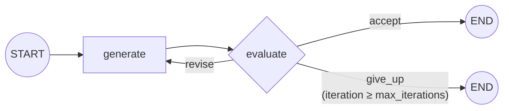

# Evaluator-Optimizer

**See also:** [`prompt_chaining`](https://github.com/jithinkk/agentic-design-patterns/tree/main/patterns/prompt_chaining) — the non-looping version of this shape: a gate that can stop the chain but never sends work back for revision.

One LLM call generates a solution; a second, separate call grades it
against explicit criteria and returns pass/fail plus feedback. On failure,
the feedback is folded back into the next generation attempt, and the loop
repeats until it passes or a `max_iterations` cap is hit.

**Use it when** there are clear evaluation criteria and iterative
refinement measurably improves the result — similar to how a human writer
revises against an editor's notes.

## Graph shape



## Where it fits

Tasks with an objectively checkable quality bar where iteration
measurably improves the result: code generation validated against tests,
writing against explicit length/style constraints, SQL generation
validated against a schema or a dry-run execution, translation checked via
back-translation. It shines specifically when generating and judging are
*asymmetric* — judging is easier, cheaper, or more reliable than getting
generation right on the first try, the same asymmetry that makes unit
tests useful for humans.

## Where not to use it

- **There's no reliable evaluator.** A vague or subjective criterion
  ("make it better") gives the loop nothing to converge against — you'll
  burn iterations without progress, or worse, get an evaluator that
  rubber-stamps everything.
- **Latency-sensitive interactive paths without a bound.** Worst-case
  latency is `max_iterations × (generate + evaluate)`; that cap needs to
  be a deliberate product decision, not an afterthought.
- **A single well-crafted prompt already succeeds reliably.** The loop
  only pays for itself when the first-pass failure rate is meaningfully
  above zero — don't add a generate/evaluate loop around a task that
  doesn't need one.

## Architectural tradeoffs

- **Worst-case cost is `2 × max_iterations` LLM calls** for one
  successful output — the most expensive pattern here per unit of
  output, and the cap directly trades quality against a cost/latency
  ceiling.
- **Correlated failure risk.** If generator and evaluator share the same
  underlying model and blind spots, the evaluator can systematically miss
  the same class of error the generator makes. Using a different, ideally
  stronger, model for the evaluator materially reduces this risk in
  production.
- **Convergence isn't guaranteed.** Some failures are structural — this
  repo's second test deliberately exercises an unsatisfiable constraint —
  so `give_up` after `max_iterations` is a required exit path, not an
  edge case. A production system needs a defined policy for what happens
  on give-up: return the best-effort draft, escalate to a human, or fail
  the request outright.
- **Prompt length grows with iteration count** as feedback accumulates
  turn over turn; long-running loops need summarization or truncation of
  older feedback to avoid context bloat.

## Infra choices for production

- **Prefer a programmatic evaluator wherever criteria are checkable by
  code** (run the generated SQL, run the unit tests, measure word count)
  over LLM-as-judge — cheaper, faster, deterministic, and immune to judge
  miscalibration. Reserve LLM-as-judge for genuinely subjective/
  qualitative criteria, as a fallback rather than a default.
- **Track the iteration-count distribution in production** — a histogram
  of how many loops requests actually take. A distribution creeping
  toward `max_iterations` is an early signal that the generator or the
  criteria need attention, before users notice degraded quality or
  latency.
- **Make `max_iterations` and give-up behavior explicit, tested, and
  monitored.** This repo's give-up test is exactly the kind of "does it
  actually stop" regression test that's easy to skip and important to
  keep — an untested exit path in a loop is a latent hang.

## Production readiness in this repo

The evaluator here is a scripted stand-in for what should be either a
real programmatic check or a real LLM-judge call — decide explicitly
which of those two the production evaluator is; the two have very
different cost, latency, and reliability profiles. Also instrument
give-up-rate as a first-class metric, not just a code path that happens
to exist.

## Relevant open source components

- LangGraph's cyclic edges (native support for exactly this loop shape)
- `deepeval` / `ragas`-style evaluation libraries for RAG/QA-shaped criteria
- Sandboxed code execution (Docker-based runners, or a service like E2B)
  when the evaluator needs to *execute* generated code, not just read it

## Run it

```bash
python main.py run evaluator-optimizer "Write a tagline for Nimbus"
```

## Test it

```bash
pytest patterns/evaluator_optimizer -v
```
