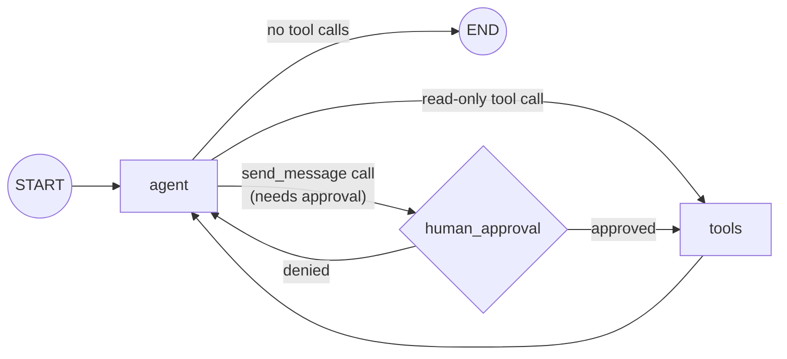

# Human-in-the-Loop

**Extends:** [`react_agent`](https://github.com/jithinkk/agentic-design-patterns/tree/main/patterns/react_agent) — same graph, plus an approval gate before side-effecting tool calls.

Extends `react_agent`'s tool loop with an approval gate: before a tool
call that does something real runs, the graph pauses via LangGraph's
`interrupt()` and waits for a human decision. Read-only tool calls
(calculator, search_docs, word_count) skip the gate entirely — only
`send_message`, a stand-in for any side-effecting action (send an email,
post to Slack, place an order), is gated here.

**Use it when** an agent has access to at least one tool with real-world
consequences. Every current source on production agent architecture is
explicit about this: human-in-the-loop is not an optional nicety bolted
onto an agent — it's the architecture pattern that makes an agent with
real tool access safe to deploy at all.

## Graph shape



`human_approval` calls `interrupt(...)`, which pauses the graph and
surfaces the pending tool call(s) to the caller via `result["__interrupt__"]`.
Resuming (`app.invoke(Command(resume=True_or_False), config)`, same
`thread_id`) continues execution: approved calls proceed to `tools`;
denied calls never run — the node injects a `ToolMessage` saying so and
routes straight back to `agent`.

## Where it fits

Any agent with tools that write, send, spend, or delete — the exact set
of actions where a wrong tool call is expensive or embarrassing to
undo. This is also, structurally, the same mechanism this very
Claude Code session's own tool-permission prompts use: pause before an
effectful action, resume once a human has weighed in.

## Where not to use it

- **Every tool call in the system needs approval.** If that's true, the
  agent isn't earning its autonomy — reconsider whether this should be a
  narrower `routing` or `prompt_chaining` workflow instead, with the
  side-effecting step as an explicit, reviewed step rather than a
  model-initiated one.
- **The approval step can't actually be answered by a human in reasonable
  time** (fully unattended batch pipelines, for instance). A blocked
  `interrupt()` with nobody to resume it just means the pipeline stalls
  forever — either provide an automated policy for that path or don't gate
  it as a blocking human decision.

## Architectural tradeoffs

- **Requires a checkpointer**, unlike every other pattern in this repo.
  `interrupt()` pauses mid-graph and needs to persist state so a *second*,
  separate `invoke()` call (potentially minutes or hours later, from a
  different process) can resume exactly where it left off. This repo uses
  an in-memory saver for the demo/tests; production needs a durable one
  (Postgres-backed, etc.) or a resumed session loses its pending approvals
  on restart.
- **The interrupted node re-runs from the top on resume.** LangGraph's
  documented behavior: everything in `request_approval` before the
  `interrupt()` call executes again after resume. This repo's node is
  read-only up to that point specifically so re-running it is harmless —
  a node with a side effect *before* its `interrupt()` call would double
  that side effect on every resume.
- **Approval is coarse-grained here** — if an `AIMessage` requests several
  tool calls and any one needs approval, the whole batch waits on a single
  yes/no. Simpler mental model for a demo; a production system with mixed
  batches might want per-call approval instead.
- **Latency becomes human-paced**, not just model-paced, for gated calls —
  the same tradeoff every review/approval step in any system makes:
  safety in exchange for a pause a fully autonomous run wouldn't have.

## Infra choices for production

- **A durable checkpointer** (Postgres-backed `PostgresSaver`, or
  equivalent) — required, not optional, once "resume" might happen after
  a process restart or from an entirely different machine (e.g. a human
  clicking "approve" in a web UI hours later).
- **Structured approval payloads** — this repo's `interrupt()` value is
  already structured (`{"action": ..., "tool_calls": [...]}`) rather than
  a free-text prompt, so a real UI can render "approve sending this
  message to Alice" instead of a raw tool-call dump.
- **An audit log of every approval decision** — who approved what, when,
  for which exact tool-call arguments. Not automatic; needs to be added
  wherever the resume decision is captured, since `interrupt()`/`Command`
  themselves don't log anything on their own.
- **A timeout/escalation policy for stuck approvals** — a request nobody
  ever resumes stays paused forever by default; production systems
  typically add a TTL that auto-denies (or escalates) after some window.

## Production readiness in this repo

The approval gate itself is real, tested LangGraph — not a simulation, and
(like `react_agent`) `run.py` sets an explicit `recursion_limit` rather
than relying on LangGraph's implicit default. What's still missing for
production: a durable checkpointer (currently in-memory, lost on
restart), an audit trail of decisions, a timeout policy for abandoned
approvals, and per-call (rather than per-batch) granularity if a single
turn can request multiple gated actions.

## Relevant open source components

- LangGraph's `interrupt()` / `Command(resume=...)` (native human-in-the-loop primitive)
- LangGraph checkpointers — `InMemorySaver` (this repo, demo-only) vs.
  `PostgresSaver` / a Redis-backed saver (production)
- Any human-review UI that can render a structured approval payload and
  call back into the graph (Slack approval buttons, an internal review
  queue, etc. — LangGraph is agnostic to what sits on the human side)

## Run it

```bash
python main.py run human-in-the-loop "Send a message to Alice: the report is ready."
```

## Test it

```bash
pytest patterns/human_in_the_loop -v
```
