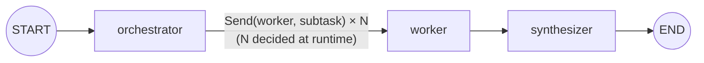

# Orchestrator-Workers

**See also:** [`parallelization`](https://github.com/jithinkk/agentic-design-patterns/tree/main/patterns/parallelization) — the simpler sibling to reach for first if the branch count is known in code.

Like `parallelization`, but the number and shape of the parallel subtasks
**isn't known ahead of time** — an orchestrator LLM call decides that at
runtime. LangGraph's `Send` primitive lets a routing function fan out to a
worker node once per subtask it just invented, and their results
accumulate into a single list via a reducer before a synthesizer combines
them.

**Use it when** the subtask breakdown is genuinely dynamic — code review
across an unknown number of changed files, research across a
model-chosen set of subtopics, etc. If you can enumerate the subtasks in
advance, plain `parallelization` is simpler.

## Graph shape



`orchestrator` writes `subtasks: list[str]`; the routing function
`continue_to_workers` turns that into `N` `Send("worker", {"subtask": ...})`
calls; each `worker` run appends one `{"subtask", "result"}` entry to
`worker_results` (an `Annotated[list, operator.add]` reducer) so the
partial results from all the parallel runs land together for
`synthesizer`.

## Where it fits

Open-ended decomposition tasks where the number and shape of subtasks
genuinely can't be known until the model reads the input: multi-file code
review, research across a model-chosen set of subtopics, summarizing a
document set whose size varies per request. Reach for this whenever you
catch yourself writing "for each X the model decides on, do Y in
parallel."

## Where not to use it

- **The subtask set is fixed/known ahead of time.** Use plain
  `parallelization` — it's simpler, easier to test, and trivially caps
  its own cost since the branch count is in the code, not the model's
  output.
- **Subtasks depend on each other (a real DAG, not embarrassingly
  parallel work).** This pattern assumes worker runs are independent;
  true sequential dependencies between subtasks need a different shape
  (nested chains, or explicit dependency edges), not `Send` fan-out.
- **You can't bound fan-out.** An adversarial or malformed orchestrator
  output could in principle request hundreds of subtasks with no natural
  cap — see Infra choices below before shipping this pattern unguarded.

## Architectural tradeoffs

- **Cost and latency now depend on the orchestrator's own decision**, not
  on code you wrote and can statically reason about. This is exactly what
  makes the pattern powerful — and risky: an orchestrator that decides on
  50 subtasks instead of 5 multiplies cost and load with no code change
  on your side.
- **Requires a correct reducer to merge worker results.** Get it wrong
  (plain assignment instead of `operator.add`-style accumulation) and
  parallel `Send`-invoked runs silently clobber each other instead of
  accumulating — a class of bug that's easy to introduce and easy to miss
  in a quick test with only one worker.
- **The subtask list is unvalidated model output in a naive
  implementation.** This repo's orchestrator parses bullet points with no
  upper bound — exactly the kind of gap that needs closing before
  production traffic.
- **Harder to debug than static parallelization** — branch count and
  identity differ per run, so tracing/logging needs to key off the
  dynamic subtask rather than a static node name.

## Infra choices for production

- **Cap `len(subtasks)` after the orchestrator step, before fan-out**
  (e.g., truncate or reject beyond N=10) — the single most important, and
  cheapest, production guardrail for this pattern.
- **Structured output for the orchestrator's plan** (a JSON array via
  tool calling) instead of a bullet-point string parsed with regex, as
  this prototype does.
- **Per-worker retry-with-backoff and timeout**, plus an explicit
  wait-for-all vs. proceed-with-partial-results policy — one slow or
  failing worker in a `Send` fan-out shouldn't silently block or fail the
  entire synthesis unless that's the deliberate choice.
- **A token/cost budget at the orchestrator level**, split across the `N`
  workers it decides on — a real production concern with no equivalent in
  statically-shaped patterns, since `N` isn't known until runtime.

## Production readiness in this repo

This is the pattern here that needs the most hardening before real
traffic: no cap on subtask count, no structured-output validation on the
orchestrator's plan, no worker-level retry/timeout, and no
partial-failure handling in the reducer join. Dynamic fan-out is powerful
specifically because it's unbounded, which is also its main operational
risk — treat the guardrails above as required, not optional, before
production use.

## Relevant open source components

- LangGraph `Send` + reducers (`operator.add` or a custom merge function)
- Structured output / tool calling for the orchestrator's plan
- [`tenacity`](https://github.com/jd/tenacity) for per-worker retries
- A distributed task queue (Celery, Ray, Temporal) if workers need to run
  outside the LangGraph process for true horizontal scaling at high
  fan-out

## Run it

```bash
python main.py run orchestrator-workers "Write a report covering pricing, onboarding, and support quality."
```

## Test it

```bash
pytest patterns/orchestrator_workers -v
```
