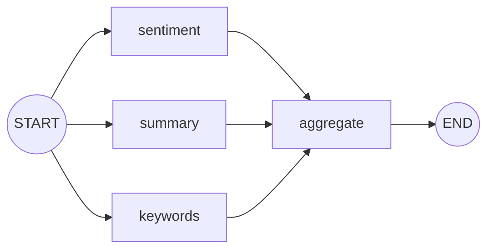

# Parallelization (Sectioning)

**See also:** [`orchestrator_workers`](https://github.com/jithinkk/agentic-design-patterns/tree/main/patterns/orchestrator_workers) — same fan-out/fan-in shape, but for when the branch count isn't known until runtime.

Splits one input into several **independent** subtasks — here, sentiment,
one-sentence summary, and keyword extraction over the same text — that run
concurrently because none of them depends on another's output, then joins
the results in an aggregation step.

**Use it when** a task cleanly decomposes into independent aspects that can
be evaluated separately and combined afterward. (The other flavor of this
pattern, "voting" — running the same prompt N times and combining the
results for a confidence check — uses the same fan-out/fan-in shape.)

## Graph shape



LangGraph runs all three branches in the same superstep and only starts
`aggregate` once all three have produced output — no extra coordination
code required.

## Where it fits

Independent sub-analyses over the same input: multi-aspect review (as
here), evaluating the same output from several angles at once, generating
in multiple languages simultaneously, or running the same prompt `N` times
and combining results for a majority vote ("voting" — the other named
flavor of this pattern, same fan-out/fan-in shape). It also fits **safety
checks that shouldn't add to critical-path latency** — run a moderation
classifier in parallel with the main generation instead of serially
blocking on it.

## Where not to use it

- **Branches actually depend on each other's output.** That's
  `prompt_chaining` — parallelization assumes true independence; forcing
  a dependent step into a parallel branch just means it silently reads
  stale/missing state.
- **The branch set isn't known ahead of time.** That's
  `orchestrator_workers` — this pattern's branches are wired into the
  graph at build time, not decided per-request.
- **The branches are trivially cheap.** The fixed overhead of a graph
  fan-out/join isn't worth it for genuinely trivial sub-tasks; a single
  combined prompt is simpler and just as fast.

## Architectural tradeoffs

- **Latency ≈ `max(branch latencies)`, not the sum** — the core reason to
  reach for this over chaining whenever the sub-tasks don't depend on
  each other.
- **Cost is still the sum of all branches** — parallel means faster, not
  cheaper; `N` branches cost `N×` one branch's tokens, so only
  parallelize dimensions you actually need.
- **Concurrency introduces real infra concerns invisible in a
  single-process demo**: provider rate limits get hit `N×` as fast,
  partial failure needs a policy (what if 2 of 3 branches succeed and one
  errors?), and result ordering at the join needs to be deterministic.
- **Branches parallelize horizontally, not just concurrently** — because
  they're independent, they can run across separate processes/workers,
  not only as concurrent coroutines within one graph run, which makes
  this pattern scale cleanly under load.

## Infra choices for production

- **Use the async path end to end.** LangGraph runs branches in the same
  superstep concurrently via its async runtime; for real providers this
  requires an async chat-model client (`ainvoke`) and invoking the graph
  with `.ainvoke()` — otherwise "parallel" branches still execute
  serially under the hood.
- **Per-branch timeouts and a partial-result join policy** — decide (and
  implement) whether the aggregate step proceeds with `N-1` results and
  flags the missing branch, or fails the whole request. LangGraph's
  per-node timeout config or a wrapping `asyncio.wait(...,
  return_exceptions=True)` are the mechanisms.
- **A rate limiter shared across branches** (e.g. a token-bucket semaphore
  in front of the chat model client) since all branches fire
  near-simultaneously against the same provider quota.

## Production readiness in this repo

The fan-out here is synchronous, single-process, and assumes every branch
succeeds — no timeout, no partial-failure handling, no rate limiting.
Before production: switch to async invocation, add a per-branch timeout
with a defined fallback, and put a rate limiter/circuit breaker in front
of the shared model client.

## Relevant open source components

- LangGraph's async execution (`ainvoke`) and `asyncio` primitives
- [`aiolimiter`](https://github.com/mjpieters/aiolimiter) or a similar
  token-bucket rate limiter
- OpenTelemetry span-per-branch tracing to visualize the fan-out/fan-in

## Run it

```bash
python main.py run parallelization "The new release is great, though onboarding docs need work."
```

## Test it

```bash
pytest patterns/parallelization -v
```
