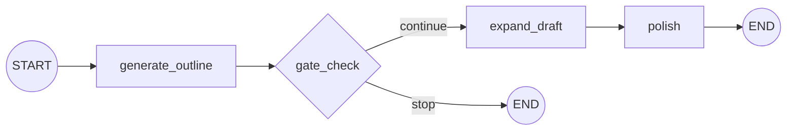

# Prompt Chaining

**See also:** [`evaluator_optimizer`](https://github.com/jithinkk/agentic-design-patterns/tree/main/patterns/evaluator_optimizer) — the looping version of this same linear shape, for when a gate needs to send work back for revision instead of just stopping it.

Decomposes a task into a fixed sequence of LLM calls, where each step's
output feeds the next. A plain Python **gate** sits between the first two
steps and can stop the chain before the (usually more expensive) later
steps run — cheaper and more reliable than trusting one LLM call to do
everything correctly in one shot.

**Use it when** a task decomposes into clear sequential steps and each step
is easier for the model to get right on its own than a single combined
prompt would be.

## Graph shape



`gate_check` is not an LLM call — it's a programmatic check on the
outline's shape.

## Where it fits

Well-defined content/document pipelines where the task naturally
decomposes into sequential steps, each easier for a model to get right in
isolation than as part of one combined prompt: outline → draft → edit,
extract → transform → summarize, translate → localize → QA. It's also the
right pattern whenever an intermediate output (the outline here) is
independently useful — worth inspecting, logging, or showing to a user
before committing to the expensive step that follows.

## Where not to use it

- **The steps don't actually depend on each other.** If `expand_draft`
  doesn't need `generate_outline`'s specific output, you're paying chain
  latency (sum of every step) for no benefit — reach for `parallelization`
  instead, which only pays `max()` of the branch latencies.
- **The path needs to branch on content, not just pass/fail.** A chain has
  one linear track; if different inputs need genuinely different
  handling, that's `routing`.
- **The task is open-ended and step count is unknown.** A chain is a fixed
  number of calls decided in code. If the model needs to decide how many
  steps or which steps to take, use `react_agent` or
  `orchestrator_workers`.
- **Interactive, low-latency UX with a long chain.** Latency compounds
  linearly with chain length; a 5+ step chain run synchronously in the
  request path will feel slow. Either keep chains short, run them async
  with a progress indicator, or reconsider the shape.

## Architectural tradeoffs

- **Latency is additive, not overlapping** — `N` steps means `N` sequential
  round-trips; unlike `parallelization`, nothing here runs concurrently.
- **Reliability compounds multiplicatively** — if each step succeeds
  independently with probability `p`, the whole chain succeeds with
  probability roughly `p^N`. This is exactly why the gate exists: catch a
  bad outline cheaply and fail fast, rather than let a bad step 1
  silently degrade every step after it.
- **Cost is linear but not uniform** — you can (and should) use a cheaper
  model for constrained early steps and reserve a stronger model for the
  step where quality matters most (here, `polish`).
- **High testability** — each node is a pure function of its input state,
  so unit-testing step-by-step (as this repo's tests do) is
  straightforward and doesn't require mocking a multi-turn conversation.
- **Strong auditability** — the full sequence of intermediate outputs is
  available in state after the run, which makes chains easy to log,
  replay, and debug compared to a loop whose trajectory varies per run.

## Infra choices for production

- **Programmatic gates wherever a cheap check can catch a bad output**
  before the next, more expensive call runs — the single highest-leverage
  cost control available in a chain, and this repo's `gate_check` is a
  minimal example of the idea.
- **A LangGraph checkpointer** (`SqliteSaver` for local/dev,
  `PostgresSaver` or a Redis-backed saver for production) so a chain can
  resume from the last completed step after a crash instead of re-running
  (and re-paying for) everything from the top.
- **Structured output at each step boundary** (`with_structured_output` /
  tool calling / a Pydantic schema) instead of passing free-text between
  steps — reduces the brittle-parsing failure mode where step `N+1`
  chokes on step `N`'s output format.
- **Per-step tracing** (LangSmith, or OpenTelemetry via
  `opentelemetry-instrumentation-langchain`) — because each step is
  already a named node, this is nearly free to add and is usually the
  fastest way to see which step degraded in an incident.

## Production readiness in this repo

This implementation is a teaching-sized skeleton: no retries, no
persistence, no timeouts, and no output-schema validation between steps.
Before production traffic, add: per-node retry/backoff (`tenacity`)
around the LLM call, a checkpointer, per-step timeouts, and structured
output validation with a repair-on-failure path when a step's output
doesn't parse.

## Relevant open source components

- LangGraph checkpointers (`SqliteSaver`, `PostgresSaver`, Redis-backed savers)
- [`tenacity`](https://github.com/jd/tenacity) for per-step retry/backoff
- LangSmith or OpenTelemetry for per-step tracing
- Pydantic / `with_structured_output` for validating output at step boundaries

## Run it

```bash
python main.py run prompt-chaining "Why LangGraph is useful for agents"
# or directly:
python -m patterns.prompt_chaining.run "Why LangGraph is useful for agents"
```

## Test it

```bash
pytest patterns/prompt_chaining -v
```
