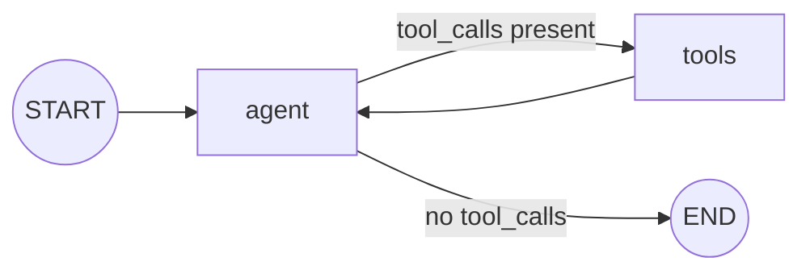

# ReAct Agent (Reason + Act)

**Extended by:** [`human_in_the_loop`](https://github.com/jithinkk/agentic-design-patterns/tree/main/patterns/human_in_the_loop) — same graph, plus an approval gate before side-effecting tool calls.

**See also:** [`routing`](https://github.com/jithinkk/agentic-design-patterns/tree/main/patterns/routing) — the same decision made once instead of repeatedly, with a fixed branch set.

The canonical "agent" loop: the model gets a system prompt, the tools it's
allowed to use, and the conversation so far; it either emits a tool call
or a final answer. Tool calls run through LangGraph's prebuilt `ToolNode`
and the result loops back to the model as a `ToolMessage`, repeating until
the model answers without calling a tool.

**Use it when** the number of steps can't be predicted up front and the
model itself needs to decide, turn by turn, whether it has enough
information to answer or needs to act first. This is the most open-ended
(and hardest to fully predict) pattern here — five of the other six are
better described as fixed "workflows"; the sixth, `human_in_the_loop`,
is this same loop with one more layer, not a different shape.

## Graph shape



Built from `langgraph.prebuilt.ToolNode` and `tools_condition` directly
against a `StateGraph`, rather than the one-line `create_react_agent`
helper, so the loop is visible end to end.

## Where it fits

Genuinely open-ended tasks where the number and sequence of steps can't
be predicted in code: multi-turn research, debugging loops, anything that
requires the model to decide "do I have enough information yet?" turn by
turn. This is the right default when you find yourself trying to
pre-enumerate branches for `routing` or `orchestrator_workers` and failing
because the space is genuinely too open to enumerate.

## Where not to use it

- **Whenever one of the other five fixed-shape patterns actually fits.**
  If you can describe the steps in advance, a workflow is strictly more
  predictable, cheaper to reason about, easier to test exhaustively, and
  safer to run unattended than an agent loop — don't reach for an agent
  by default.
- **Unattended actions with real-world side effects** (payments,
  deletions, sending messages) without an approval step or a hard tool
  allowlist. This exact graph has no built-in concept of "this action is
  irreversible, pause here" — see
  [`human_in_the_loop`](https://github.com/jithinkk/agentic-design-patterns/tree/main/patterns/human_in_the_loop),
  which is this pattern plus exactly that gate.
- **Latency-critical paths.** The number of round-trips is unbounded by
  design, so p99 latency is fundamentally less predictable than a
  fixed-depth workflow, even with a step cap in place.

## Architectural tradeoffs

- **Unboundedness is the whole point, and the whole risk.** No static
  bound on latency, cost, or tool-call count unless you add one — the
  price of flexibility is losing the compile-time guarantees the other
  five patterns give for free.
- **Three more failure surfaces than a fixed workflow**: the model can
  decide to stop too early or too late, pick the wrong tool, or
  misinterpret a tool's output — and these are much harder to unit test
  exhaustively than a fixed graph. This repo's tests cover three scripted
  paths; a real agent's input space is unbounded.
- **Every bound tool is part of the trust boundary.** The model can call
  any tool it's given with any arguments it constructs, so tool design —
  what it can touch, what inputs it validates, what it refuses — is a
  security control here, not just a capability list.
- **Unbounded state growth.** `messages` grows every turn with no natural
  cap in the base pattern; long-running agent conversations need explicit
  context management (summarization, trimming, windowing) or they'll blow
  the context window or the cost budget.

## Infra choices for production

- **Set a recursion/step limit and a wall-clock timeout on every
  invocation** (LangGraph's `recursion_limit`) — non-negotiable for any
  agent loop exposed to real traffic.
- **Put a human-approval interrupt in front of any tool call with real
  side effects** (writes, payments, sends) using LangGraph's `interrupt()`
  — see [`human_in_the_loop`](https://github.com/jithinkk/agentic-design-patterns/tree/main/patterns/human_in_the_loop)
  for the fully worked version of this, a small addition on top of what's here.
- **Use a persistent checkpointer** (Postgres- or Redis-backed) so
  long-running agent runs survive process restarts and can resume after a
  human-approval pause. This repo's state is in-memory and doesn't
  survive a crash mid-loop.
- **Sandbox any tool that executes code or touches the filesystem/network,
  and validate tool arguments server-side rather than trusting the
  model's JSON.** This repo's `calculator` tool is a deliberate example:
  it parses expressions with `ast`, not `eval`, specifically so it can't
  become an arbitrary-code-execution tool.
- **Add tracing per tool call** (LangSmith / OpenTelemetry) — for an agent
  loop, "what tools were called, with what arguments, in what order" is
  the primary debugging surface, more than the final answer.

## Production readiness in this repo

This agent has no recursion limit, no persistence, no approval gate, and
a three-tool sandboxed toy toolset — intentionally the least
production-ready pattern here, because openness is inherently the hardest
thing to harden. Before production: add a step cap, add
tool-level authorization/sandboxing, add a checkpointer, and — if any tool
has real side effects — use `human_in_the_loop` instead of this pattern
directly; the gate isn't optional hardening, it's the difference between
an agent and an agent you can actually deploy.

## Relevant open source components

- `langgraph.prebuilt` (`ToolNode`, `tools_condition`, and
  `create_react_agent` for a batteries-included version of this exact loop)
- LangGraph checkpointers for persistence; LangGraph `interrupt` for
  human-in-the-loop
- LangSmith / OpenTelemetry for tool-call tracing
- Sandboxed execution tools (E2B, Docker-based runners) for any tool that
  runs arbitrary code

## Run it

```bash
python main.py run react-agent "What is (12 + 8) * 3?"
python main.py run react-agent "Explain what langgraph is used for"
python main.py run react-agent "What is the capital of France?"
```

## Test it

```bash
pytest patterns/react_agent -v
```
