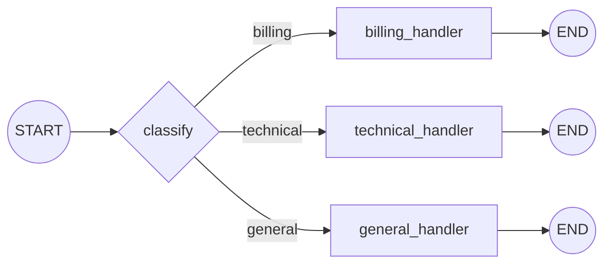

# Routing

A cheap classification step inspects the input and dispatches it to one of
several specialized downstream prompts (in a real system, potentially
different models, tools, or context per branch), instead of forcing one
generic prompt to handle every kind of request well.

**Use it when** inputs fall into distinct categories that are each better
served by a focused prompt (or a different model/tool) than by one
one-size-fits-all prompt.

## Graph shape



## Where it fits

Multi-intent systems (support bots, multi-domain assistants) where inputs
cleanly cluster into a handful of categories, each better served by a
distinct prompt, model, tool, or context than a one-size-fits-all prompt.
It's also a very common **cost router** in production: classify query
difficulty and send easy queries to a cheap/fast model while reserving a
frontier model for hard ones — same graph shape, different reason to use
it.

## Where not to use it

- **Queries are genuinely multi-intent.** A single query needing both
  billing and technical handling loses information through a router that
  forces one branch. Consider a broader agent, or multi-label
  classification feeding into `parallelization`.
- **Categories are ambiguous or numerous (10+).** Flat classification
  accuracy degrades as category count and overlap grow, and a wide,
  hand-maintained branch list becomes its own maintenance burden.
  Consider hierarchical routing or an embedding-based retrieval router
  instead.
- **Misclassification is costly and undetectable downstream.** If a wrong
  route produces a plausible-but-wrong answer with no signal that
  anything went wrong, invest in a confidence threshold and a fallback
  branch before shipping — see below.

## Architectural tradeoffs

- **Adds one classification call to every request**, even simple ones —
  worth it only if the downstream specialization (a better prompt, a
  cheaper model, different tools) outweighs that fixed cost.
- **Misrouting is a silent failure mode.** Unlike a crashed step, a wrong
  route just produces a confidently wrong answer from the wrong
  specialist — there's no automatic detection built into the pattern
  itself.
- **Centralizes behavior in one decision point.** Adding a new category is
  a small, isolated change (one more branch), but changing the
  classification prompt reshapes traffic to *every* branch at once —
  a single point of behavioral drift to watch in evals.
- **Enables model-tiering as a first-class design choice** — the
  classifier itself is usually well served by a small/cheap model even
  when the handlers need a stronger one.

## Infra choices for production

- **Structured output for the category, not free text.** This repo's fake
  classifier returns a bare word for simplicity; a real router should use
  tool calling / an enum-constrained JSON schema so the category can
  never be out-of-vocabulary or require string parsing.
- **A confidence threshold and fallback branch.** Log a confidence score
  alongside the category, and route low-confidence classifications to a
  safe default (the general handler, or a human) instead of trusting
  every classification blindly.
- **An embedding-similarity or few-shot classifier** as the router head
  instead of a full LLM call, when category count is large or latency is
  tight — often much cheaper than an LLM round-trip for a task that's
  fundamentally nearest-neighbor matching.

## Production readiness in this repo

The classifier here is deterministic keyword matching inside the fake
responder, standing in for a real structured-output classification call.
Before production: swap in tool-calling/structured output for the
category, add a low-confidence fallback path, and track route-distribution
and per-route error-rate metrics to catch classifier drift over time.

## Relevant open source components

- `with_structured_output` / function calling (LangChain), or
  [`instructor`](https://github.com/jxnl/instructor) for structured output
- Vector databases (Chroma, Qdrant, pgvector) for embedding-based routing
- LangSmith for route-distribution and per-route error dashboards

## Run it

```bash
python main.py run routing "I was charged twice for my subscription"
```

## Test it

```bash
pytest patterns/routing -v
```
